# 🔄 Fact-Checking Research Workflow Guide

This guide walks you through the complete research pipeline from raw data to final analysis.

## Pipeline Overview

```mermaid
graph LR
    A[📊 Dataset] --> B[🔍 Evidence Retrieval]
    B --> C[📝 Sentence Selection]
    C --> D[⚖️ Verdict Prediction]
    D --> E[📈 Disagreement Analysis]
```



## Step-by-Step Workflow

### 1. 📊 **Dataset Preparation**

**Location**: `Dataset/`

#### Setup Raw Data
```bash
# Place your datasets in Dataset/Raw/
Dataset/Raw/
├── Averitec/        # Real-world fact-checking
├── Liar/           # Political statements
├── PubHealth/      # Health claims
└── SciFact/        # Scientific claims
```

#### Preprocessing (if needed)
```bash
# Run any dataset-specific preprocessing
python Dataset/Preprocessing/clean_dataset.py --dataset averitec
```

---

### 2. 🔍 **Evidence Retrieval**

**Location**: `Evidence_Retrieval/`

#### A. Build Document Indices

**For BM25 Retrieval:**
```bash
cd Evidence_Retrieval/BM25/
python BM25.py
```

**For Semantic Retrieval:**
```bash
# First, encode documents
cd Evidence_Retrieval/Utils/
python document-encoding-n-storing.py

# Then retrieve similar documents
cd ../Semantic/
python retrieve.py
```

#### B. Web Search (Optional)
```bash
cd Evidence_Retrieval/Web_Search/
python elasticsearch_search.py
```

**Output**: Document IDs and relevance scores for each claim

---

### 3. 📝 **Sentence Selection**

**Location**: `Sentence_Selection/`

#### Extract Relevant Sentences
```bash
cd Sentence_Selection/Multi_Source/

# For PubMed sources
python sentence_retrieve_pubmed.py

# For Wikipedia sources  
python sentence_retrieve_wiki.py

# For negated/challenging claims
python sentence_retrieve_pubmed_negative.py
python sentence_retrieve_wiki_negative.py
```

#### Process Multiple Sources
```bash
# Combine evidence from multiple sources
python merge_evidence_sources.py
```

**Output**: Claim-evidence pairs in format:
```
[CLAIM] [SEP] [EVIDENCE_SENTENCE_1] [EVIDENCE_SENTENCE_2] ...
```

---

### 4. ⚖️ **Verdict Prediction**

**Location**: `Verdict_Prediction/`

#### A. Local Model Inference

```bash
cd Verdict_Prediction/Models/LLM/

# Choose your model and dataset
python Llama-405B.py          # Meta's largest model
python Mistral.py             # Mistral Large
python Phi-4.py               # Microsoft Phi-4
python Qwen2.5.py             # Qwen 2.5

# For specific datasets
cd Averitec/
python Llama-405B.py          # Averitec-specific configuration
```

#### B. API-Based Models

```bash
# Currently no API-based models configured
# Add API scripts here as needed
```

#### C. Batch Processing

```bash
# For cluster/SLURM environments
sbatch run.slurm Llama-405B.py
```

**Output**: Classifications with confidence scores:
```
claim	evidence	classification	confidence_score
```

---

### 5. 📈 **Disagreement Analysis**

**Location**: `Disagreement_Analysis/`

#### A. Collect Model Outputs
```bash
# Ensure all models have generated predictions
ls Verdict_Prediction/Models/LLM/*/Result/
```

#### B. Run Analysis Scripts
```bash
cd Disagreement_Analysis/Scripts/

# Analyze model agreement
python model_agreement_analysis.py

# Examine confidence calibration
python confidence_calibration.py

# Generate visualizations
python create_analysis_plots.py
```

#### C. Generate Reports
```bash
# Create comprehensive analysis report
python generate_disagreement_report.py
```

**Output**: 
- Model agreement matrices
- Confidence distribution plots
- Calibration curves
- Statistical summaries

---

## Configuration

### Environment Setup
```bash
# Copy template and configure
cp env.template .env

# Edit with your settings:
# BASE_DATA_DIR=/path/to/your/data
# CACHE_DIR=/path/to/your/models
# HUGGINGFACE_TOKEN=your_token
# GOOGLE_API_KEY=your_key
```

### Model Selection
```python
# In any script
from config import Config
config = Config()

# Access configured paths
data_path = config.get_dataset_path('averitec', 'Evidence', 'file.txt')
model_cache = config.CACHE_DIR
```

## Research Tips

### 🎯 **Focused Experiments**
- Start with one dataset (e.g., SciFact) 
- Use one retrieval method initially
- Test with smaller models first

### 🔄 **Iterative Development**
- Run evidence retrieval → sentence selection → prediction
- Analyze results before scaling up
- Compare different retrieval strategies

### 📊 **Systematic Evaluation**
- Use consistent evaluation metrics
- Document parameter choices
- Track model performance patterns

### 🔍 **Debugging Pipeline**
- Check intermediate outputs at each stage
- Validate evidence quality before prediction
- Monitor model confidence patterns

## Common Issues & Solutions

### Missing Dependencies
```bash
pip install -r Verdict_Prediction/Models/LLM/requirements.txt
pip install python-dotenv retriv groq
```

### Path Configuration Errors
```bash
# Ensure .env file is properly configured
# Check config.py for correct path mappings
python -c "from config import Config; Config.validate_config()"
```

### Memory Issues
```bash
# Use smaller batch sizes
# Enable model offloading
# Monitor GPU memory usage
```

### API Rate Limits
```bash
# Increase THROTTLE_DELAY in config
# Use retry mechanisms
# Implement exponential backoff
```

## Performance Optimization

### 🚀 **Speed Improvements**
- Use GPU acceleration for embeddings
- Batch process multiple claims
- Cache model outputs
- Parallelize independent operations

### 💾 **Memory Optimization**
- Stream large datasets
- Use model quantization
- Clear unnecessary variables
- Monitor memory usage

### 📈 **Quality Enhancement**
- Experiment with different embedding models
- Tune similarity thresholds
- Try ensemble methods
- Validate on held-out data

---

## Next Steps

After completing the pipeline:

1. **📊 Analyze Results**: Review model performance and agreement patterns
2. **🔬 Deep Dive**: Investigate interesting cases and failure modes
3. **📝 Document Findings**: Create research summaries and insights
4. **🔄 Iterate**: Refine pipeline based on results
5. **📢 Share**: Prepare results for publication or presentation

Happy fact-checking! 🎉